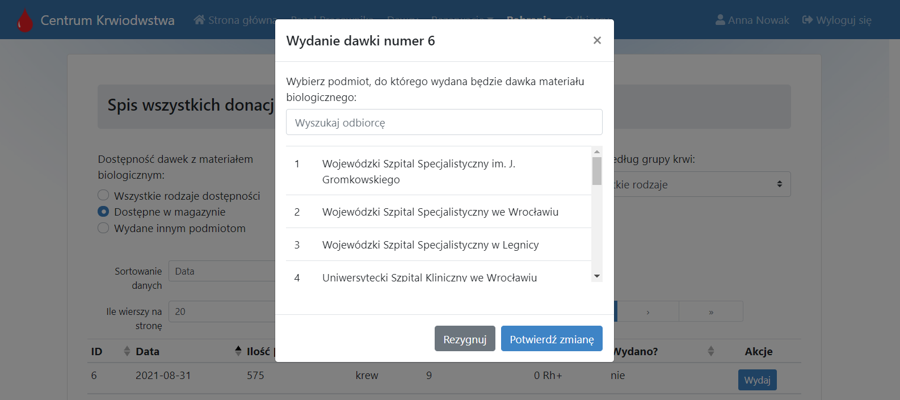

# BloodDonationCentre Application

The repository contains a Vue.js application for managing the blood donation centre.

## Technologies

Core technologies used in the project:

* Vue 2
* Vue Router
* Axios
* Bootstrap Vue

## Key application features

* User registration and login page 
* Logged donor can:
    * book an appointment for blood or plasma donation 
    * view new/archived reservations and donations 
    * view statistics about donations 
* Logged employee can:
    * manage the donors' personal data  
    * book/manage appointments for donations 
    * manage/view donations 
    * mark the release of doses of biological material to other entities 
    * view statistics about stored biological material 
* Admin can manage all employees in donation centre
* The system takes care of providing the appropriate interval between donations

More screenshot available [here](ui_screenshots)

